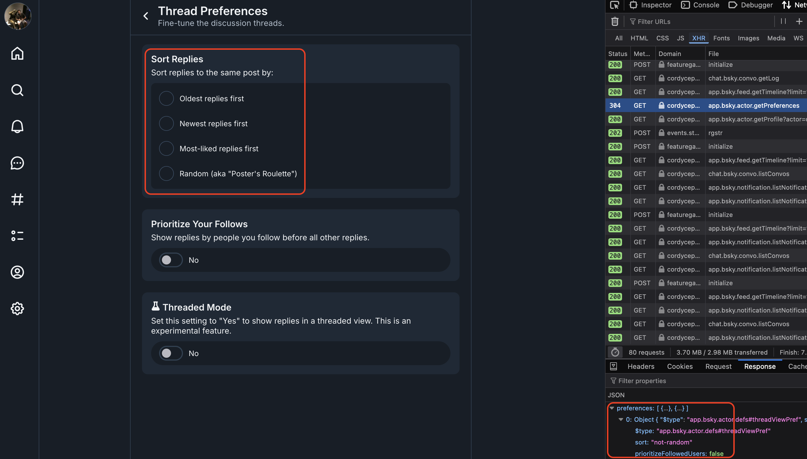

# Notes

Keeping some notes on the behavior of the API I notice as I development.

## Inconsistencies

### Actors

- Setting invalid sort values on the `app.bsky.actor.putPreferences` endpoint is allowed, no value will then be selected
  on your thread preferences page. This is a valid payload:

```json
{
    "preferences": [
        {
            "$type": "app.bsky.actor.defs#threadViewPref",
            // Not valid value according to the docs
            "sort": "not-random",
            "prioritizeFollowedUsers": false
        }
    ]
}
```

results in:


